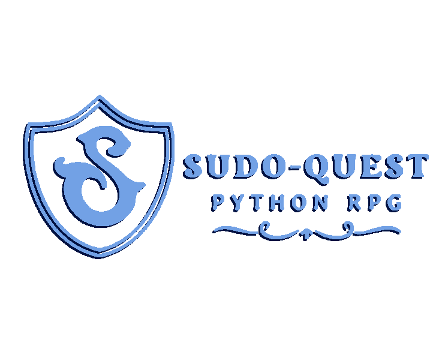
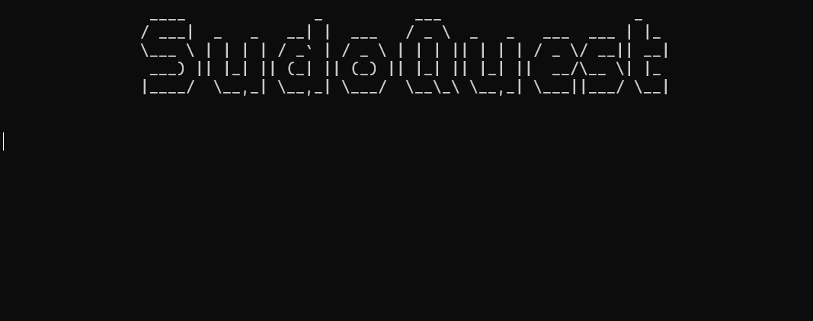

# SudoQuest - *RPG Python*



**SudoQuest** est un **rogue-like** en ligne de commandes codé en **Python**.

## L'équipe

Il est développé par l'équipe Sudo-su composée de :  

- Sébastien ABELA
- Thomas BREMARD  
- Matteo DECOUT  
- Romain IGOUNET  
- Mateo LALANNE DE MIRAS  
- Grégoire SEGUIN  

## Le jeu



### Information développement

Le jeu à été développé sous **Python 3.11** .  

- Il a été codé principalement en **POO** :  

  - Les personnages / ennemis
  - Les commandes
  - Les évenements
  - L'inventaire
  - Les objets
  - Les combats

- Certaines parties ont été codées de manière **procédurale** :  

  - Les sons
  - L'affichage

## Installation

SudoQuest nécessite certaines libraires de Python pour fonctionner :

```sh
pip install rich pygame pyfiglet art
```

A l'heure actuelle, le fichier **sudoquest.py** doit être exécuté depuis un terminal.

```sh
python sudoquest.py
```

*Nous pourrions compiler proprement le jeu pour le transformer en **.exe** (avec pyinstaller par exmeple)*

### Principe

Le joueur crée son personnage en choisissant une classe et en attribuant un certain nombre de points de compétences dans différentes catégories :

- HP  ❤️
- ATK  ⚔️
- DEF  🛡️
- VIT  ⚡️

Il peut inscrire des commandes dans la console qui lui permettront de s'aventurer dans le mystérieux donjon Sudo …

### Systèmes

Le joueur peut explorer le donjon. Aléatoirement, il peut rencontrer :

- Des coffres
- Des monstres
- Des pièges
- Des couloirs secrets
- Des marchands

Le joueur peut trouver **équipement** et **potions** afin de l'aider dans son aventure.

### Commandes

- *help* (afficher la page d'aide)
- *explore* (permet d'avancer dans le donjon)
  - *combat* (engager un combat contre un monstre rencontré)
  - *fuite* (tenter de fuit le combat)
- *inventaire* (permet d'afficher son inventaire)  
- *heal* (permet d'utiliser des potions)
- *stats* (permet de connaitre ses statistiques actuelles)

## Mises à jour éventuelles

*Ci dessous, une feuille de route de nos futures mises à jour.*

### Must

- Un écran titre  ✔️
- Un écran de Game Over  ⏳
- Différents monstres  ✔️
- Couloirs secrets  ⏳  
  - Boss  

### Should

- Equipement  ⏳
- Expérience / Niveaux  ✔️
  - *Ennemis + puissants*

### Could

- Combat avec choix d'action  ⏳
  - *Attaque, défense ou soin*  

- Bonus de classes : ⏳
  - *Par arme (arcs pour Achers, ...)*  ⏳
  - *Par classe (saignement pour Warior, ...)*  ⏳

- Magasin d'achat d'items  ⏳

### Would

- Musiques  ✔️
- Sons d'ambiance ✔️
- Meilleur affichage ⏳
  - *librairires comme **pygame** ou **curses***  

- Sauvegarde + Tableau des scores ⏳
  - *.json*

- Joueurs AI  ⏳
- Sorts et compétences par gain d'XP  ⏳
